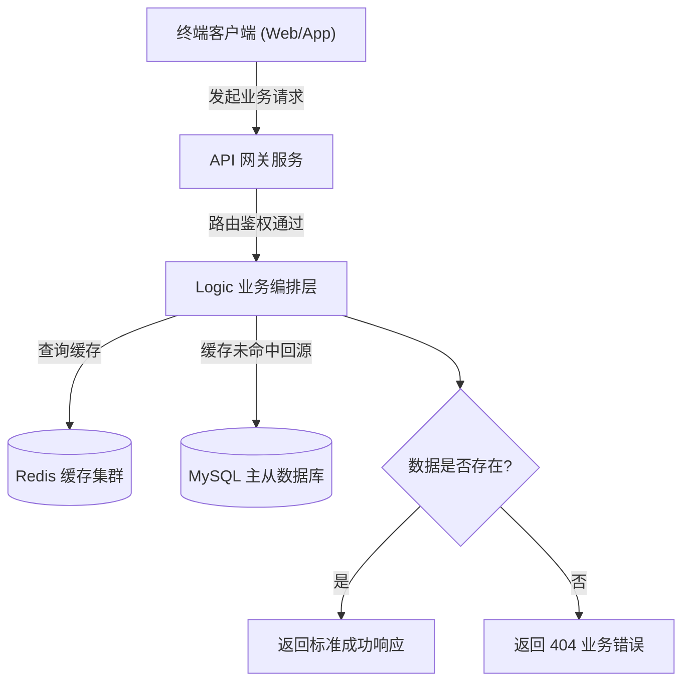
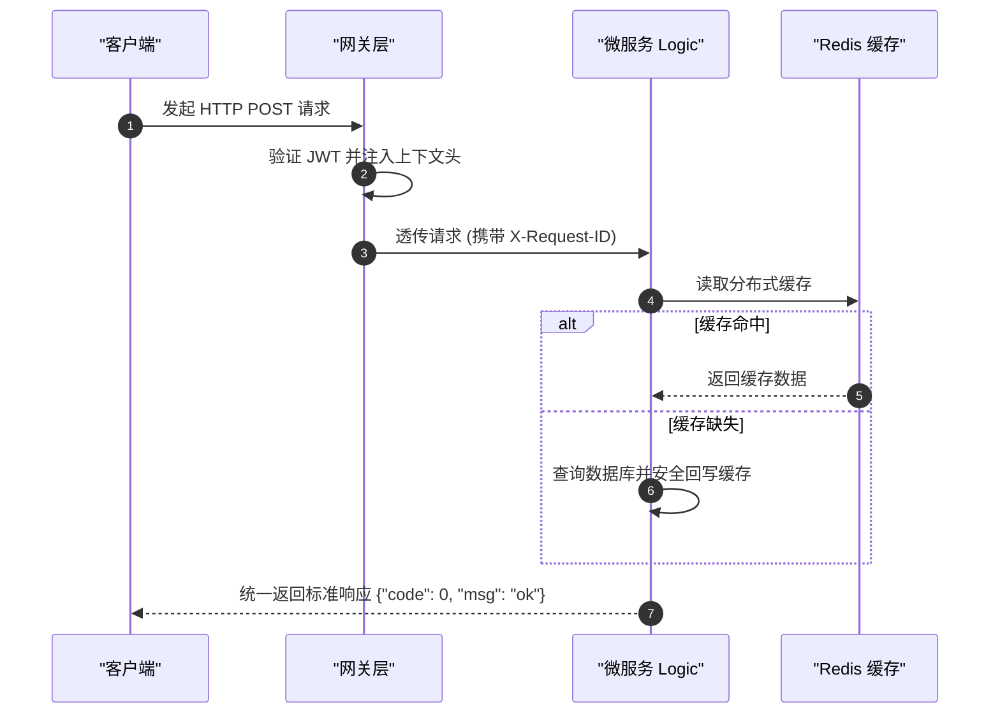

# 项目技术文档治理与 Mermaid 渲染规范技能 (Project Documentation Skill)

## 概述 (Overview)

本技能定义了研发工程师与 AI 编码助手在为软件工程编写、维护技术文档与架构图表时的通用工业级标准。

核心突破在于：**摆脱传统文档仅面向人类的单一视角，构建“人类工程师 (Human-Facing) + AI Agent (Agent-Facing)”双重视角的文档与知识库体系**；同时提供自适应文档目录探测机制与彻底杜绝预览器 AST 解析崩溃的 Mermaid 4 大渲染铁律。

### 核心设计原则

1. **目录非硬编码自适应探测 (Folder-Agnostic Discovery)**：不强制绑定特定目录名，智能探测识别项目既有文档目录，尊重不同团队与个人的存放习惯。
2. **人机双重视角架构 (Dual-Audience Architecture)**：既提供人类可读的业务全景与架构设计，又专门为后续进场的 AI 编码助手建立高密度的上下文锚点（Context Anchors）。
3. **分类分层子目录治理 (Categorized Hierarchy)**：严禁数十篇文档无序平铺在根目录下，必须按职责分门别类归入子目录。
4. **增量维护与完整性原则 (Incremental & Non-Destructive)**：严禁未经确认直接清空或盲目覆写已有重要章节，必须保持文档与最新代码逻辑严密同步。
5. **Mermaid 渲染防坑 4 大铁律 (Zero-Crash Diagramming)**：严格遵循规避各类 Markdown 解析器词法崩溃的语法安全边界。

---

# 1. 智能目录探测与非硬编码规范 (Folder Discovery)

在创建或查阅文档前，必须在**当前操作项目的根目录**（以 `.git`、`go.mod`、`pyproject.toml`、`package.json`、`composer.json` 为根边界）执行自适应探测：

```text
1. 检查是否存在既有技术文档目录：
   - docs/
   - wiki/
   - documentation/
   - project_wiki/
   - doc/
2. 若命中任意既有目录：一律沿用该既有目录，保持项目历史风格统一，严禁擅自新建别名目录；
3. 若均不存在：根据行业通用惯例，在当前项目根目录下初始化创建通用的 docs/ 目录；
4. 绝对红线：严禁在系统根路径 (/Users/garfield/ 等) 或父级无关目录中新建文档！
```

---

# 2. 人机双重视角文档体系设计 (Dual-Audience Design)

一份卓越的工程文档必须同时服务于**人类工程师**与**AI Agent 结对伙伴**两种读者：

```text
┌────────────────────────────────────────────────────────────────────────┐
│                        项目技术文档库 (docs/)                          │
├───────────────────────────────────┬────────────────────────────────────┤
│     面向人类工程师 (Human-Facing) │      面向 AI Agent (Agent-Facing)  │
├───────────────────────────────────┼────────────────────────────────────┤
│ • 业务全景与产品需求背景          │ • 领域核心实体与术语映射字典       │
│ • 核心物理拓扑与架构时序图        │ • 关键代码路径映射表 (Path Mapping)│
│ • 接口请求/响应契约手册           │ • 架构决策记录 (ADR / Why & Gotchas│
│ • 开发者本地运行与部署配置指引    │ • 模块扩展模板与工程硬红线速查     │
└───────────────────────────────────┴────────────────────────────────────┘
```

## 2.1 面向人类工程师的文档要点 (Human-Facing)
- **业务价值优先**：说明“为什么做这个功能”、“解决了什么业务痛点”；
- **图形化与可视化**：使用规范的 Mermaid 流程图、时序图直观展示系统交互；
- **排障与操作指引**：清晰列出配置参数、环境变量说明、常见问题（FAQ）排查步骤。

## 2.2 面向 AI Agent 的上下文锚点要点 (Agent-Facing Context)
为了让后续进场的 AI 编码助手在接手任务时**不“失忆”、不盲目造轮子、不臆造不存在的代码**，必须维护高密度的上下文索引：

1. **领域术语与实体映射表 (Domain Terms & Entity Mapping)**：
   - 明确全系统核心概念的标准英文命名、对应主键 ID 命名、以及禁止混用的别名（避免 AI 随性使用 `user_id` / `customer_id` / `account_id` 乱串）。
2. **代码路径精准映射表 (Code Path Mapping)**：
   - 直接标明关键组件所在的代码文件绝对/相对路径：
     ```markdown
     - 业务规则编排 (Logic): app/order/internal/logic/
     - 数据持久层 (Model): pkg/model/order_model.go
     - 领域枚举定义: pkg/enums/order_status.go
     - 统一上下文提取: pkg/ctxdata/
     ```
3. **架构决策记录 (ADR & Gotchas - 为什么不这么做)**：
   - 记录既往填坑结论（例如：“为什么不使用全局单例 DB”、“为什么长 ID 必须加 `,string`”、“为什么某个表不能直接查必须走 Redis”），防止下一个 Agent 好心办坏事误推翻现有设计。

---

# 3. 分类分层子目录治理结构 (Directory Hierarchy)

严禁把全工程所有设计说明书、接口文档、部署配置全部平铺混杂。推荐采用以下标准分类子目录：

```text
docs/ (或项目既有文档目录)
│
├── README.md                      # 文档索引总导航与架构全景简介
│
├── architecture/                  # 核心架构与领域设计
│   ├── system_topology.md         # 物理部署与服务交互拓扑
│   ├── domain_models.md           # 核心业务领域实体与状态机
│   └── adr_decisions.md           # 架构决策记录 (ADR & 踩坑历史)
│
├── api/                           # 接口与通信契约
│   ├── http_contracts.md          # REST API 路由、请求响应格式与错误码
│   ├── rpc_protocols.md           # gRPC / Protobuf 微服务通信契约
│   └── event_streams.md           # 消息队列事件格式 / WebSocket 协议
│
├── guides/                        # 研发与运维实战指引
│   ├── local_development.md       # 本地环境搭建、依赖中间件与启动步骤
│   ├── configuration.md           # 配置文件参数字典与环境变量映射
│   └── troubleshooting.md         # 常见故障定位手段与核心日志检索
│
└── agent-context/                 # 专为 AI Agent 设计的高密度上下文地图
    ├── path_mapping.md            # 核心领域实体与代码物理路径映射
    ├── term_dictionary.md         # 全系统术语命名与防混淆字典
    └── coding_redlines.md         # 本项目专属代码审查红线清单
```

---

# 4. 文档严谨性与增量维护准则 (Incremental Maintenance)

1. **核心逻辑完整严谨**：记录业务方案时必须把核心分支逻辑写详尽，公式算法、限制条款、边界约束、错误码必须完整记录。
2. **严禁盲目覆写 (No Blind Overwrite)**：
   - 更新已有文档时，必须先阅读全文理解既有上下文；
   - 采用增量追加或局部精准替换（Replace Chunk）；
   - **绝对禁止未经用户确认直接清空或盲目重写已有重要章节**。
3. **代码与文档强同步**：每次修改核心业务逻辑或接口契约后，必须同步更新对应的文档，保证文档即真实系统镜像。

---

# 5. Mermaid 图表渲染防坑 4 大铁律 (Zero-Crash Diagramming)

> 🚨 **核心红线（全系统适用）**：
> 各种 Markdown 预览器（GitHub、VSCode、Notion、Obsidian、Typora 等）的 Mermaid AST 解析器对语法异常极其敏感。编写任何 Mermaid 图表时，**必须 100% 遵守以下 4 大绝对红线**，彻底根除语法崩溃！

### 🚫 铁律 1：严禁菱形/判断节点嵌套花括号 `{...}`
- **崩溃根因**：Mermaid 中 `{` 和 `}` 是菱形判断节点的形状语法（如 `DECISION{"是否有效?"}`）。若在节点文本内再次出现花括号，AST 词法分析器会当场发生死循环或抛出致命 Syntax Error。
- ❌ **严禁写法**：`DECISION{"检查租户: {tenant_id}"}` 或 `A{"status in {1,2}}"}`
- ✅ **标准写法**：`DECISION["检查租户: <tenant_id>"]` 或 `DECISION{"检查租户: tenant_id"}`

### 🚫 铁律 2：连线条件 `|...|` 必须为纯文本
- **崩溃根因**：连线管道符 `-->|条件|` 内部严禁包含中英文圆括号 `()`、逗号 `,`、分号 `;`、冒号 `:` 等特殊符号，否则许多预览器会中断连线解析。
- ❌ **严禁写法**：`-->|超时未响应 (超过 30s)|` 或 `-->|错误码 (如 404, 500)|`
- ✅ **标准写法**：`-->|超时超过 30 秒|` 或 `-->|请求发生错误|`

### 🚫 铁律 3：所有节点 Label 文本强制显式双引号包裹
- **崩溃根因**：节点文本若包含空格、英文冒号 `:`、斜杠 `/`、或 SQL 关键字（如 `IN`、`WHERE`），若无双引号包裹，会被解析器误识别为节点属性或图形标记。
- ❌ **严禁写法**：`NODE[URL: /api/v1/user]` 或 `DB[(SELECT * FROM users)]`
- ✅ **标准写法**：`NODE["URL: /api/v1/user"]` 或 `DB[("SELECT * FROM users")]`

### 🚫 铁律 4：连线与容器约束 (精确连接到节点 ID)
- **崩溃根因**：箭头只能连接到具体的节点 ID，**严禁直接将连线箭头连向 `subgraph` 容器名称**；同时仅使用各大平台均标准支持的图表类型（如 `flowchart TD/LR`、`sequenceDiagram`、`stateDiagram-v2`、`classDiagram`、`erDiagram`）。
- ❌ **严禁写法**：`A["发起请求"] --> BackendCluster`（其中 `BackendCluster` 是一个 `subgraph`）
- ✅ **标准写法**：`A["发起请求"] --> GatewayNode`（精确连接至 `subgraph` 内部的第一个入口节点 ID）

---

# 6. 标准 Mermaid 范式示例 (Safe Templates)

### 6.1 安全架构流程图范式 (Safe Flowchart)


### 6.2 安全时序图范式 (Safe Sequence Diagram)

