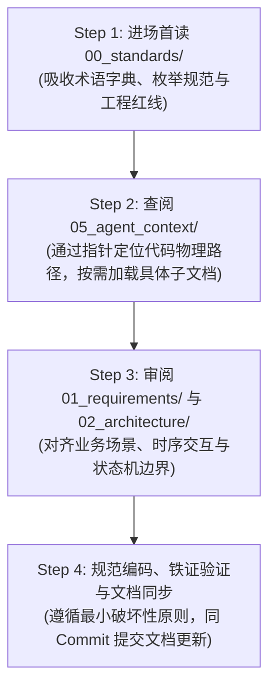
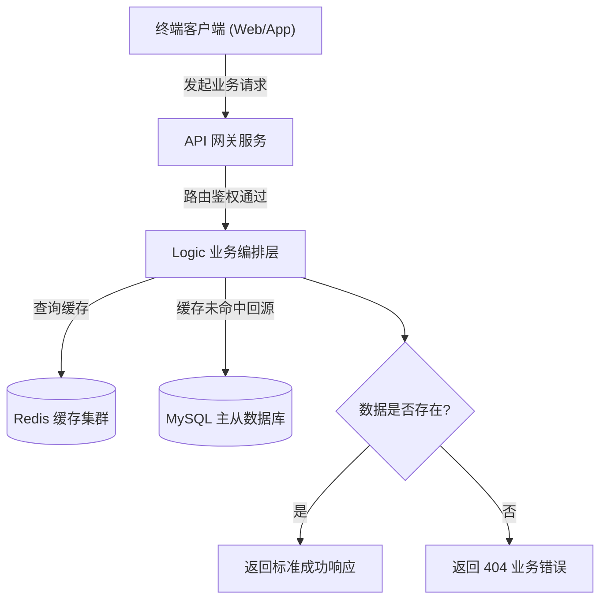
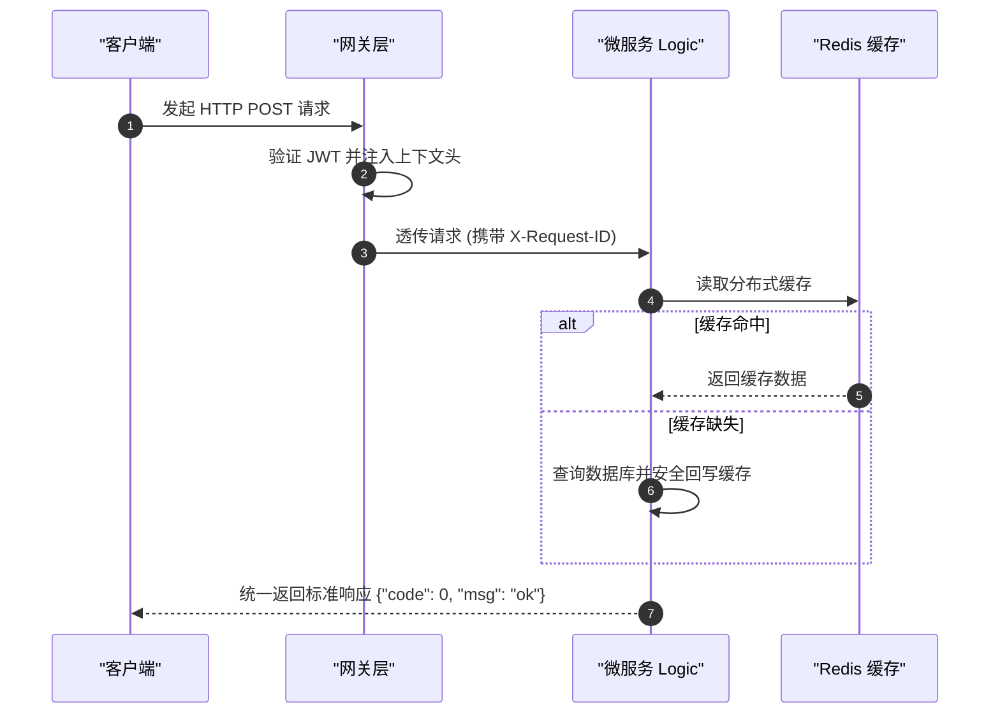

# 项目技术文档治理与知识工程规范技能 (Project Documentation Skill)

## 概述 (Overview)

本技能定义了研发工程师与 AI 编码助手在为软件工程编写、维护技术文档、架构决策与图表时的工业级标杆标准。

融合全球权威文档标准与 AI Agent 时代前沿工程实践：
1. **Diátaxis 四象限框架** (Python/Django 官方标准：Tutorials, How-To, Reference, Explanation 正交分类)；
2. **MADR 架构决策记录标准** (Markdown Architectural Decision Records，决策与否决权衡沉淀)；
3. **“00 号标准约束与工程红线第一法则”** (全系统唯一基准字典与上帝文件禁止硬红线)；
4. **“高价值 BUG 案例与深度避坑档案 (Post-Mortems)”** (拒绝鸡毛蒜皮，将深层故障转化为永久免疫资产)；
5. **渐进式披露协议 (Progressive Disclosure)** (拒绝 Token 爆炸，通过高密度索引指针按需加载)；
6. **Mermaid 4 大防崩语法铁律** (彻底杜绝各大 Markdown 预览器词法解析崩溃)。

---

# 1. 智能目录探测与非硬编码规范 (Folder Discovery)

在创建或查阅文档前，必须在**当前操作项目的根目录**（以 `.git`、`go.mod`、`pyproject.toml`、`package.json`、`composer.json` 为根边界）执行自适应探测：

```text
1. 检查是否存在既有技术文档目录：
   - docs/
   - wiki/
   - documentation/
   - project_wiki/
   - doc/
2. 若命中任意既有目录：一律沿用该既有目录，保持项目历史风格统一，严禁擅自新建别名目录；
3. 若均不存在：根据行业通用惯例，在当前项目根目录下初始化创建通用的 docs/ 目录；
4. 绝对红线：严禁在系统根路径 (/Users/garfield/ 等) 或父级无关目录中新建文档！
```

---

# 2. 数字优先级与 Diátaxis 四象限分层治理结构 (Numbered Diátaxis Hierarchy)

严禁把全工程所有设计说明书、接口文档、部署配置全部平铺混杂。大型生产级工程采用以下**显式编号优先级分层目录**，并严格对齐 Diátaxis 文档模式：

```text
docs/ (或项目自适应命中的既有文档目录)
│
├── README.md                                  # 文档索引总导航、系统全景与快速指引
│
├── 00_standards/                              # 🚨【P0 级基石·Diátaxis: Reference】标准术语与全局工程规范总纲
│   ├── 00_global_standards_and_redlines.md    # 核心总纲：实体字典、枚举规范、单一职责、上帝文件禁止红线
│   ├── entity_dictionary.md                   # 核心业务实体标准命名、字段名、废弃禁用词对照字典
│   ├── enums_reference.md                     # 全局领域枚举对照字典 (底层 tinyint vs 外部 string 双向转换)
│   ├── pkg_hierarchy_standards.md             # 🏛️ pkg/common 基础层分层架构标准 (Go pkg / Python common 一级收紧、二级按需嵌套、*x 扩展包)
│   ├── coding_redlines.md                     # 工程红线清单 (禁止上帝文件、单文件行数软硬阈值、防重锁粒度)
│   └── architectural_guardrails.md            # 架构反模式禁令 (严禁静默重试/兜底、严禁跨层穿透、严禁无状态破坏)
│
├── 01_requirements/                           # 【P1 级全景·Diátaxis: Explanation】业务场景与产品背景
│   ├── product_overview.md                    # 业务全景、产品核心价值与用户画像
│   └── feature_matrix.md                      # 核心功能矩阵、业务边界与里程碑版本规划
│
├── 02_architecture/                           # 【P2 级设计·Diátaxis: Explanation】系统拓扑、领域建模与状态机
│   ├── system_topology.md                     # 物理部署、微服务交互拓扑与网络边界
│   ├── domain_models.md                       # 领域实体关系图 (ER)、数据库表结构与分表规划
│   ├── workflow_and_fsm.md                    # 核心业务交互时序图 (Mermaid) 与有限状态机 (FSM) 跃迁图
│   └── adr_decisions/                         # 🏛️【MADR 标准架构决策记录 (只增不删)】
│       ├── README.md                          # ADR 决策总览索引
│       └── adr_0001_<decision_topic>.md       # 结构化架构决策记录 (上下文、决策、否决项、权衡)
│
├── 03_api/                                    # 【P3 级契约·Diátaxis: Reference】接口契约与通信协议
│   ├── http_contracts.md                      # RESTful API 契约、路由分组、统一响应格式与业务错误码
│   ├── rpc_protocols.md                       # gRPC / Protobuf 微服务内部通信契约
│   └── event_streams.md                       # 消息队列 (Kafka/RabbitMQ) 事件 Schema 与 WebSocket 协议
│
├── 04_operations/                             # 【P4 级实操·Diátaxis: How-To】研发实战、配置与高价值故障档案
│   ├── local_development.md                   # 本地环境搭建、依赖中间件拉起与启动步骤
│   ├── configuration_dictionary.md            # 配置文件参数字典与环境变量映射表
│   ├── troubleshooting_faq.md                 # 常见日常排错速查与诊断命令
│   └── post_mortems/                          # 🩺【核心资产·高价值 BUG 案例与深度避坑档案】
│       ├── README.md                          # 经典案例目录索引与避坑知识图谱
│       └── case_YYYYMMDD_<topic>.md           # 经典案例深度复盘 (机理剖析、反例对比、永久免疫防线)
│
└── 05_agent_context/                          # 【P5 级机器索引·渐进式披露中枢】专为 AI Agent 设计的高密度上下文地图
    ├── codebase_path_mapping.md               # 核心领域实体与代码物理路径精准映射表
    └── context_entrypoint.md                  # AI 进场启动指针 (引导执行 Progressive Disclosure 协议)
```

---

# 3. AI Agent 进场作业四步法 (Standards-First & Progressive Disclosure)

吸纳 Anthropic 与 Agent Skills 的**“渐进式披露 (Progressive Disclosure)”**原则，严禁一股脑全量扫盘引发 Token 爆炸与注意力稀释，AI 必须严格执行以下四步协议：



### 🚨 Step 1：【进场首读】必须且强制首读 `00_standards/`
- **吸收术语基准**：严格核对 `entity_dictionary.md`，使用标准英文标识（如统一使用 `company_id`，严禁混用已废弃的历史别名）；
- **吸收枚举规范**：核对底层 `tinyint` 与外部 `string` 的双向转换标准，严禁在代码中写死魔法数字或魔法字符串；
- **建立红线戒备**：
  - **严禁上帝文件 (No God File)**：单文件控制在 200~300 行内，超过 500 行必须审视拆分；
  - **严禁静默重试与默认兜底**；
  - **严格分层职责**：Handler 仅做反序列化与响应包装，严禁直接写 SQL 或直接穿透调用 Model。

### 🧭 Step 2：【按需路由】查阅 `05_agent_context/` 指针
- 查阅 `codebase_path_mapping.md` 锁定 Logic、Model、Enum、Middleware 的物理文件位置；
- 仅按需加载当前任务涉及的特定接口契约或架构子文档，保持上下文窗口清爽。

### 🏛️ Step 3：【需求与架构对齐】查阅需求与设计文档
- 审阅具体需求的业务背景与 In-Scope/Out-of-Scope 边界；
- 对齐业务时序图与状态机逆向流分支，查阅相关 ADR 了解历史决策约束。

### 🛠️ Step 4：【编码、铁证验证与文档同步】
- 编写代码时严格落实标准约束与红线；
- 运行自动化检验命令，提供真实执行铁证；
- 遵循 Docs-as-Code，若改动了接口或数据模型，在同一次 Commit 中同步修改文档。

---

# 4. MADR 标准架构决策记录规范 (`docs/02_architecture/adr_decisions/`)

吸纳开源著名的 **MADR (Markdown Architectural Decision Records)** 极简标准，记录重大技术选型与架构折中。所有 ADR 文档遵循以下结构：

```markdown
# ADR-0001: [标题：决策的核心主题，如：状态机跃迁使用 Redis Lua 分布式锁替代乐观锁]

## 1. 状态 (Status)
- **状态**：提议中 (Proposed) / 已采纳 (Accepted) / 已废弃 (Deprecated) / 已被替代 (Superseded by ADR-0005)
- **决定日期**：2026-XX-XX
- **决策制定人**：[架构师 / 核心开发人员]

## 2. 背景上下文与面临挑战 (Context and Problem Statement)
- 面临什么高并发、数据一致性或性能瓶颈？
- 现有方案在什么量级下无法支撑？

## 3. 考虑过的备选方案 (Considered Options)
1. **方案 A (最终采纳)**：[简要说明]
2. **方案 B (已否决)**：[简要说明]
3. **方案 C (已否决)**：[简要说明]

## 4. 决策结果与理由 (Decision Outcome)
- **最终选定**：方案 A
- **采纳理由**：
  - [理由 1：写入时延降低至 2ms]
  - [理由 2：完美化解 TOCTOU 竞态]
- **否决理由 (Why Rejected)**：
  - *方案 B 否决原因*：在 5000 QPS 下数据库重试冲突率高达 35%，导致主库 CPU 爆满。

## 5. 优势与代价折中 (Pros and Cons of the Options)
### 带来优势 (Good Consequences)
- 彻底消除了并发脏读与状态回跳。
### 产生代价与防范措施 (Bad Consequences & Mitigations)
- 增加了对 Redis 实例高可用 (Sentinel/Cluster) 的依赖；必须实现自动降级告警。
```

---

# 5. 高价值 BUG 案例与深度避坑档案治理规范 (`docs/04_operations/post_mortems/`)

踩坑经验是系统抵御风险的“免疫抗体”。必须建立高价值 BUG 案例档案，绝不允许在同一个坑里跌倒两次。

### 5.1 案例入库价值门槛 (Value Threshold - 严格甄选)
- ❌ **坚决不记**：低级语法错误、单词拼写错、少导包、缺少环境依赖等一目了然的问题；
- ✅ **必须入库的高价值案例**：
  1. **高并发与分布式竞态**：Goroutine 竞态破坏内存、分布式锁粒度失当引发死锁、非幂等重试导致资金/库存重扣；
  2. **隐蔽资源与生命周期泄漏**：SQL/HTTP 连接未释放耗尽连接池、Context 乱传导致协程永久泄漏、大对象未流式处理导致 OOM；
  3. **底层框架与三方协议黑盒陷阱**：ORM 隐式默认值覆盖、JSON 反序列化精度丢失 (64-bit int 溢出)、第三方 API 乱序回调；
  4. **状态机隐蔽非法跃迁**：复杂业务逆向流遗漏、超时 Worker 扫描并发覆盖已完成状态。

### 5.2 标准案例复盘模板 (`case_YYYYMMDD_<topic>.md`)

```markdown
# 🩺 经典故障复盘与避坑档案：[简明主题，如：高并发下订单状态分布式竞态与脏读覆盖]

## 1. 案例基本信息
- **发生时间**：2026-XX-XX
- **影响范围**：[如：支付回调与用户主动取消并发时，极小概率导致订单状态卡死在中间态]
- **严重定级**：P1 (核心交易资损隐患) / P2 (核心链路异常)
- **对应提交 Commit**：`fix(order): 采用 Redis Lua 分布式原子锁化解状态跃迁竞态`

## 2. 故障现象与隐蔽触发路径 (Symptom & Hidden Path)
- **现象描述**：[精准描述线上出现的诡异报错或数据异常]
- **触发路径**：
  ```text
  第三方支付异步回调 (goroutine A) ───┐
                                     ├──> 几乎同时触发 UpdateOrderStatus() ──> 发生并发脏写覆盖
  用户端在超时前一秒点击取消 (goroutine B) ┘
  ```
- **为什么极难发现**：本地单并发测试 100% 正常，只有在网络延迟抖动且并发达到峰值时才会偶发触发。

## 3. 根本原因机理剖析 (Root Cause Analysis)
- **直接诱因**：数据库更新语句使用了绝对值赋值 `status = 2`，而非基于状态机当前版本的条件 CAS 更新；
- **深层架构根因**：缺乏跨服务分布式悲观防重锁，业务编排层在读取订单后到写入之间存在 80ms 的外部 RPC 耗时窗口，造成典型的“TOCTOU”竞态漏洞。

## 4. ❌ 错误反例代码 vs ✅ 稳健解法对比 (Code Diff)

### ❌ 危险脆弱写法 (引发故障的代码)
```go
// 错误：读取与更新非原子，中间有外部耗时操作，极易并发脏写
order, _ := l.svcCtx.OrderModel.FindOne(l.ctx, req.OrderId)
res, _ := l.svcCtx.PaymentRpc.Verify(l.ctx, req.PayId)
order.Status = enums.OrderStatusPaid
_ = l.svcCtx.OrderModel.Update(l.ctx, order)
```

### ✅ 优雅免疫写法 (修复后的代码)
```go
// 正确：引入 Redis Lua 分布式原子锁 + 数据库乐观锁版本断言
lockKey := fmt.Sprintf("lock:order:%d", req.OrderId)
acquire, err := l.svcCtx.Redis.SetnxEx(l.ctx, lockKey, "1", 5)
if !acquire {
    return errorx.NewBizError(errorx.ErrCodeConflict, "订单正在处理中，请勿重复操作")
}
defer l.svcCtx.Redis.Del(context.Background(), lockKey)

affected, err := l.svcCtx.OrderModel.TransitStatus(l.ctx, req.OrderId, enums.OrderStatusPaying, enums.OrderStatusPaid)
```

## 5. 🛡️ 永久免疫防线 (Immunity Guardrails)
1. **自动化单测防线**：编写了并发度为 50 的 Goroutine 并发竞态压测用例纳入 CI 门禁；
2. **架构红线收录**：写入 `00_standards/architectural_guardrails.md`，明令禁止在状态机跃迁中省略条件校验。

## 6. 💡 给后续开发与 AI 结对助手的警示箴言 (Key Takeaway)
> 凡涉及多事件源并发变更同一实体状态时，严禁使用“先查后改”逻辑！必须强制使用分布式锁或 SQL 级原子条件跃迁。
```

---

# 6. 人机双重视角与 Docs-as-Code 规范 (Dual-Audience Design)

```text
┌────────────────────────────────────────────────────────────────────────┐
│                        项目技术文档库 (docs/)                          │
├───────────────────────────────────┬────────────────────────────────────┤
│     面向人类工程师 (Human-Facing) │      面向 AI Agent (Agent-Facing)  │
├───────────────────────────────────┼────────────────────────────────────┤
│ • 业务全景与产品需求背景          │ • 领域核心实体与术语映射字典       │
│ • 核心物理拓扑与架构时序图        │ • 关键代码路径映射表 (Path Mapping)│
│ • 接口请求/响应契约手册           │ • 架构决策记录 (ADR / Why & Gotchas│
│ • 开发者本地运行与部署配置指引    │ • 模块扩展模板与工程硬红线速查     │
└───────────────────────────────────┴────────────────────────────────────┘
```

### Docs-as-Code 强同步铁律 (Doc Drift Prevention)
- **同生命周期同 Commit 提交**：当对核心数据表字段、枚举、有限状态机（FSM）或统一接口进行重构时，**必须在同一个 Commit 中同步修改对应的文档**；
- 严禁“先上线代码，下周再补文档”的技术债延期行为，保证文档即真实系统代码镜像。

---

# 7. Mermaid 图表渲染防坑 4 大铁律 (Zero-Crash Diagramming)

> 🚨 **核心红线（全系统适用）**：
> 编写任何 Mermaid 图表时，**必须 100% 遵守以下 4 大绝对红线**，彻底根除语法崩溃！

### 🚫 铁律 1：严禁菱形/判断节点嵌套花括号 `{...}`
- **崩溃根因**：Mermaid 中 `{` 和 `}` 是菱形判断节点的形状语法（如 `DECISION{"是否有效?"}`）。若在节点文本内再次出现花括号，AST 词法分析器会当场发生死循环或抛出致命 Syntax Error。
- ❌ **严禁写法**：`DECISION{"检查租户: {tenant_id}"}` 或 `A{"status in {1,2}}"}`
- ✅ **标准写法**：`DECISION["检查租户: <tenant_id>"]` 或 `DECISION{"检查租户: tenant_id"}`

### 🚫 铁律 2：连线条件 `|...|` 必须为纯文本
- **崩溃根因**：连线管道符 `-->|条件|` 内部严禁包含中英文圆括号 `()`、逗号 `,`、分号 `;`、冒号 `:` 等特殊符号，否则许多预览器会中断连线解析。
- ❌ **严禁写法**：`-->|超时未响应 (超过 30s)|` 或 `-->|错误码 (如 404, 500)|`
- ✅ **标准写法**：`-->|超时超过 30 秒|` 或 `-->|请求发生错误|`

### 🚫 铁律 3：所有节点 Label 文本强制显式双引号包裹
- **崩溃根因**：节点文本若包含空格、英文冒号 `:`、斜杠 `/`、或 SQL 关键字（如 `IN`、`WHERE`），若无双引号包裹，会被解析器误识别为节点属性或图形标记。
- ❌ **严禁写法**：`NODE[URL: /api/v1/user]` 或 `DB[(SELECT * FROM users)]`
- ✅ **标准写法**：`NODE["URL: /api/v1/user"]` 或 `DB[("SELECT * FROM users")]`

### 🚫 铁律 4：连线与容器约束 (精确连接到节点 ID)
- **崩溃根因**：箭头只能连接到具体的节点 ID，**严禁直接将连线箭头连向 `subgraph` 容器名称**；同时仅使用各大平台均标准支持的图表类型（如 `flowchart TD/LR`、`sequenceDiagram`、`stateDiagram-v2`、`classDiagram`、`erDiagram`）。
- ❌ **严禁写法**：`A["发起请求"] --> BackendCluster`（其中 `BackendCluster` 是一个 `subgraph`）
- ✅ **标准写法**：`A["发起请求"] --> GatewayNode`（精确连接至 `subgraph` 内部的第一个入口节点 ID）

---

# 8. 标准 Mermaid 范式示例 (Safe Templates)

### 8.1 安全架构流程图范式 (Safe Flowchart)


### 8.2 安全时序图范式 (Safe Sequence Diagram)

