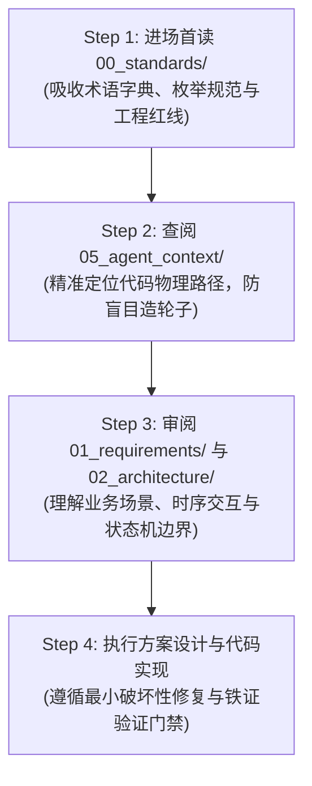
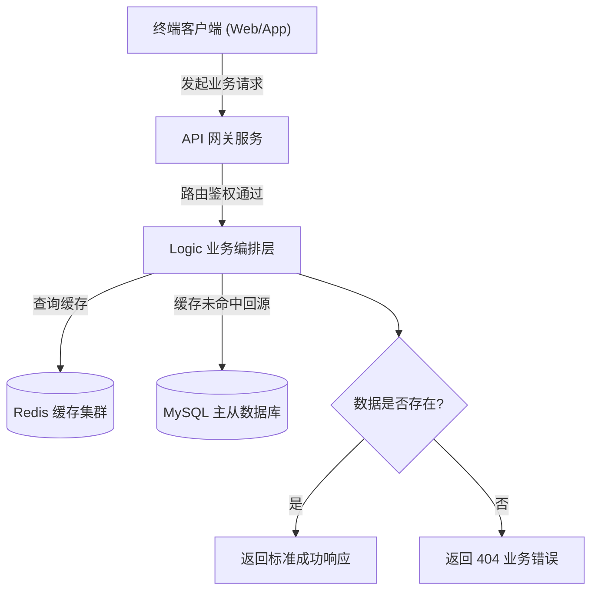
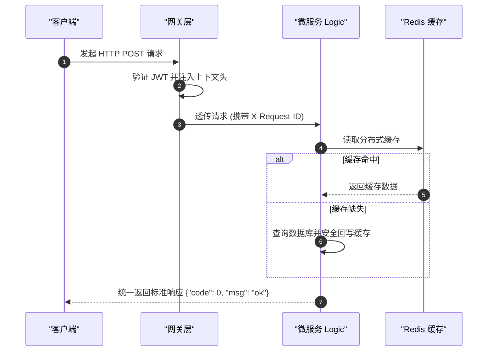

# 项目技术文档治理与 Mermaid 渲染规范技能 (Project Documentation Skill)

## 概述 (Overview)

本技能定义了研发工程师与 AI 编码助手在为软件工程编写、维护技术文档与架构图表时的通用工业级标准。

核心突破在于：**摆脱传统文档仅面向人类的单一视角，构建“人类工程师 (Human-Facing) + AI Agent (Agent-Facing)”双重视角的文档与知识库体系**。同时确立**“标准约束与工程红线第一法则 (Standards & Redlines First Principle)”**，让 AI 结对伙伴在接手项目时首先建立严密的规则防线与边界共识，彻底杜绝凭感觉编码、制造上帝文件与违反架构红线。

### 核心设计原则

1. **标准约束与工程红线第一法则 (Standards & Redlines First Principle - P0 必读基石)**：
   - 项目的“术语映射、核心枚举、分层职责、单文件行数与上帝文件拆分红线、架构反模式禁令”是全工程的宪章总纲；
   - **AI Agent 在操作项目时，必须首先查阅此规范，建立绝对边界认知后，方可阅读需求与实现代码**。
2. **数字优先级分层子目录治理 (Numbered Hierarchy)**：
   - 采用业界大型工程标杆的编号分层结构（`00_standards/` -> `01_requirements/` -> `02_architecture/` -> `03_api/` -> `04_operations/` -> `05_agent_context/`），层级清晰，权重分明。
3. **目录非硬编码自适应探测 (Folder-Agnostic Discovery)**：
   - 智能探测识别项目既有文档目录（`docs/`、`wiki/`、`documentation/`），尊重项目存量风格，严禁擅自新建别名目录。
4. **人机双重视角架构 (Dual-Audience Architecture)**：
   - 既提供人类可读的业务全景与物理拓扑，又专门为 AI 编码助手建立高密度的物理路径映射与上下文锚点。
5. **增量维护与完整性原则 (Incremental & Non-Destructive)**：
   - 严禁未经确认直接清空或盲目覆写已有重要章节，代码与文档同生命周期绑定更新。
6. **Mermaid 渲染防坑 4 大铁律 (Zero-Crash Diagramming)**：
   - 严格遵循规避各类 Markdown 解析器词法崩溃的语法安全边界。

---

# 1. 智能目录探测与非硬编码规范 (Folder Discovery)

在创建或查阅文档前，必须在**当前操作项目的根目录**（以 `.git`、`go.mod`、`pyproject.toml`、`package.json`、`composer.json` 为根边界）执行自适应探测：

```text
1. 检查是否存在既有技术文档目录：
   - docs/
   - wiki/
   - documentation/
   - project_wiki/
   - doc/
2. 若命中任意既有目录：一律沿用该既有目录，保持项目历史风格统一，严禁擅自新建别名目录；
3. 若均不存在：根据行业通用惯例，在当前项目根目录下初始化创建通用的 docs/ 目录；
4. 绝对红线：严禁在系统根路径 (/Users/garfield/ 等) 或父级无关目录中新建文档！
```

---

# 2. 数字优先级分层子目录治理结构 (Numbered Hierarchy)

严禁把全工程所有设计说明书、接口文档、部署配置全部平铺混杂。大型生产级工程推荐采用以下**显式编号优先级分层目录**：

```text
docs/ (或项目自适应命中的既有文档目录)
│
├── README.md                                  # 文档索引总导航与架构全景简介
│
├── 00_standards/                              # 🚨【P0 级必读基石】标准术语与全局工程开发规范总纲
│   ├── 00_global_standards_and_redlines.md    # 核心总纲：实体术语字典、枚举规范、单一职责、文件拆分与代码红线
│   ├── entity_dictionary.md                   # 核心业务实体标准命名、字段名、废弃禁用词对照字典
│   ├── enums_reference.md                     # 全局领域枚举对照字典 (底层 tinyint vs 外部 string 双向转换)
│   ├── coding_redlines.md                     # 工程红线清单 (禁止上帝文件、单文件行数软硬阈值、防重锁粒度)
│   └── architectural_guardrails.md            # 架构反模式禁令 (严禁静默重试/兜底、严禁跨层穿透、严禁无状态破坏)
│
├── 01_requirements/                           # 【P1 级需求全景】业务场景与产品背景
│   ├── product_overview.md                    # 业务全景、产品核心价值与用户画像
│   └── feature_matrix.md                      # 核心功能矩阵、业务边界与里程碑版本规划
│
├── 02_architecture/                           # 【P2 级架构设计】系统拓扑、领域建模与状态机
│   ├── system_topology.md                     # 物理部署、微服务交互拓扑与网络边界
│   ├── domain_models.md                       # 领域实体关系图 (ER)、数据库表结构与分表规划
│   ├── workflow_and_fsm.md                    # 核心业务交互时序图 (Mermaid) 与有限状态机 (FSM) 跃迁图
│   └── adr_decisions.md                       # 架构决策记录 (ADR) 与既往填坑结论 (Why & Gotchas)
│
├── 03_api/                                    # 【P3 级协议契约】接口契约与通信协议
│   ├── http_contracts.md                      # RESTful API 契约、路由分组、统一响应格式与业务错误码
│   ├── rpc_protocols.md                       # gRPC / Protobuf 微服务内部通信契约
│   └── event_streams.md                       # 消息队列 (Kafka/RabbitMQ) 事件 Schema 与 WebSocket 协议
│
├── 04_operations/                             # 【P4 级实操指南】研发实战、配置与运维排障
│   ├── local_development.md                   # 本地环境搭建、依赖中间件拉起与启动步骤
│   ├── configuration_dictionary.md            # 配置文件参数字典与环境变量映射表
│   └── troubleshooting_faq.md                 # 常见线上故障定位 SOP、核心排障命令与日志排查速查
│
└── 05_agent_context/                          # 【P5 级机器索引】专为 AI Agent 设计的高密度上下文地图
    ├── codebase_path_mapping.md               # 核心领域实体与代码物理路径精准映射表
    └── context_entrypoint.md                  # AI 进场启动指针 (优先引导阅读 00_standards/)
```

---

# 3. AI Agent 进场作业四步法 (Standards-First SOP)

为了让后续进场的 AI 编码助手在接手任务时**不“失忆”、不盲目造轮子、不臆造不存在的代码、不违反项目红线**，AI 必须严格执行以下四步作业协议：



### 🚨 Step 1：【进场首读】必须且强制首读 `00_standards/`
- **吸收术语基准**：严格核对 `entity_dictionary.md`，使用标准英文标识（如统一使用 `company_id`，严禁混用已废弃的 `tenant_id`、`corp_id`）；
- **吸收枚举规范**：核对底层 `tinyint` 与外部 `string` 的双向转换标准，严禁在代码中写死魔法数字或魔法字符串；
- **建立红线戒备**：
  - **严禁上帝文件 (No God File)**：单文件控制在 200~300 行内，超过 500 行必须审视拆分；
  - **严禁静默重试与默认兜底**；
  - **严格分层职责**：Handler 仅做反序列化与响应包装，严禁直接写 SQL 或直接穿透调用 Model。

### 🧭 Step 2：【路径对齐】查阅 `05_agent_context/` 或 `path_mapping`
- 查阅代码物理路径映射，获知 Logic、Model、Enum、Middleware 的实际存放位置；
- 避免全量扫盘引发 Token 浪费或产生幻觉路径。

### 🏛️ Step 3：【需求与架构对齐】查阅需求与设计文档
- 审阅具体需求的业务背景与 In-Scope/Out-of-Scope 边界；
- 对齐业务时序图与状态机逆向流分支。

### 🛠️ Step 4：【编码与铁证验证】
- 编写代码时严格落实标准约束与红线；
- 运行自动化检验命令，提供真实执行铁证。

---

# 4. 人机双重视角文档体系设计 (Dual-Audience Design)

```text
┌────────────────────────────────────────────────────────────────────────┐
│                        项目技术文档库 (docs/)                          │
├───────────────────────────────────┬────────────────────────────────────┤
│     面向人类工程师 (Human-Facing) │      面向 AI Agent (Agent-Facing)  │
├───────────────────────────────────┼────────────────────────────────────┤
│ • 业务全景与产品需求背景          │ • 领域核心实体与术语映射字典       │
│ • 核心物理拓扑与架构时序图        │ • 关键代码路径映射表 (Path Mapping)│
│ • 接口请求/响应契约手册           │ • 架构决策记录 (ADR / Why & Gotchas│
│ • 开发者本地运行与部署配置指引    │ • 模块扩展模板与工程硬红线速查     │
└───────────────────────────────────┴────────────────────────────────────┘
```

## 4.1 面向人类工程师的文档要点 (Human-Facing)
- **业务价值优先**：说明“为什么做这个功能”、“解决了什么业务痛点”；
- **图形化与可视化**：使用规范的 Mermaid 流程图、时序图直观展示系统交互；
- **排障与操作指引**：清晰列出配置参数、环境变量说明、常见问题（FAQ）排查步骤。

## 4.2 面向 AI Agent 的上下文锚点要点 (Agent-Facing Context)
1. **领域术语与实体映射表 (Domain Terms & Entity Mapping)**：
   - 明确全系统核心概念的标准英文命名、对应主键 ID 命名、以及禁止混用的别名。
2. **代码路径精准映射表 (Code Path Mapping)**：
   - 直接标明关键组件所在的代码文件绝对/相对路径：
     ```markdown
     - 业务规则编排 (Logic): app/order/internal/logic/
     - 数据持久层 (Model): pkg/model/order_model.go
     - 领域枚举定义: pkg/enums/order_status.go
     - 统一上下文提取: pkg/ctxdata/
     ```
3. **架构决策记录 (ADR & Gotchas - 为什么不这么做)**：
   - 记录既往填坑结论（例如：“为什么不使用全局单例 DB”、“为什么长 ID 必须加 `,string`”、“为什么某个表不能直接查必须走 Redis”），防止下一个 Agent 好心办坏事误推翻现有设计。

---

# 5. 文档严谨性与增量维护准则 (Incremental Maintenance)

1. **核心逻辑完整严谨**：记录业务方案时必须把核心分支逻辑写详尽，公式算法、限制条款、边界约束、错误码必须完整记录。
2. **严禁盲目覆写 (No Blind Overwrite)**：
   - 更新已有文档时，必须先阅读全文理解既有上下文；
   - 采用增量追加或局部精准替换（Replace Chunk）；
   - **绝对禁止未经用户确认直接清空或盲目重写已有重要章节**。
3. **代码与文档同生命周期强绑定 (Doc Drift Prevention)**：
   - 当对核心数据表字段、有限状态机（FSM）或统一接口进行重构时，**必须在同一个 Commit 中同步修改对应的文档**；
   - 严禁“先上线代码，下周再补文档”的技术债延期行为，保证文档即真实系统镜像。

---

# 6. Mermaid 图表渲染防坑 4 大铁律 (Zero-Crash Diagramming)

> 🚨 **核心红线（全系统适用）**：
> 各种 Markdown 预览器（GitHub、VSCode、Notion、Obsidian、Typora 等）的 Mermaid AST 解析器对语法异常极其敏感。编写任何 Mermaid 图表时，**必须 100% 遵守以下 4 大绝对红线**，彻底根除语法崩溃！

### 🚫 铁律 1：严禁菱形/判断节点嵌套花括号 `{...}`
- **崩溃根因**：Mermaid 中 `{` 和 `}` 是菱形判断节点的形状语法（如 `DECISION{"是否有效?"}`）。若在节点文本内再次出现花括号，AST 词法分析器会当场发生死循环或抛出致命 Syntax Error。
- ❌ **严禁写法**：`DECISION{"检查租户: {tenant_id}"}` 或 `A{"status in {1,2}}"}`
- ✅ **标准写法**：`DECISION["检查租户: <tenant_id>"]` 或 `DECISION{"检查租户: tenant_id"}`

### 🚫 铁律 2：连线条件 `|...|` 必须为纯文本
- **崩溃根因**：连线管道符 `-->|条件|` 内部严禁包含中英文圆括号 `()`、逗号 `,`、分号 `;`、冒号 `:` 等特殊符号，否则许多预览器会中断连线解析。
- ❌ **严禁写法**：`-->|超时未响应 (超过 30s)|` 或 `-->|错误码 (如 404, 500)|`
- ✅ **标准写法**：`-->|超时超过 30 秒|` 或 `-->|请求发生错误|`

### 🚫 铁律 3：所有节点 Label 文本强制显式双引号包裹
- **崩溃根因**：节点文本若包含空格、英文冒号 `:`、斜杠 `/`、或 SQL 关键字（如 `IN`、`WHERE`），若无双引号包裹，会被解析器误识别为节点属性或图形标记。
- ❌ **严禁写法**：`NODE[URL: /api/v1/user]` 或 `DB[(SELECT * FROM users)]`
- ✅ **标准写法**：`NODE["URL: /api/v1/user"]` 或 `DB[("SELECT * FROM users")]`

### 🚫 铁律 4：连线与容器约束 (精确连接到节点 ID)
- **崩溃根因**：箭头只能连接到具体的节点 ID，**严禁直接将连线箭头连向 `subgraph` 容器名称**；同时仅使用各大平台均标准支持的图表类型（如 `flowchart TD/LR`、`sequenceDiagram`、`stateDiagram-v2`、`classDiagram`、`erDiagram`）。
- ❌ **严禁写法**：`A["发起请求"] --> BackendCluster`（其中 `BackendCluster` 是一个 `subgraph`）
- ✅ **标准写法**：`A["发起请求"] --> GatewayNode`（精确连接至 `subgraph` 内部的第一个入口节点 ID）

---

# 7. 标准 Mermaid 范式示例 (Safe Templates)

### 7.1 安全架构流程图范式 (Safe Flowchart)


### 7.2 安全时序图范式 (Safe Sequence Diagram)


---

# 8. 文档与 Mermaid 渲染报错排查 (Troubleshooting & Syntax Linting)

当 Markdown 预览器或 GitHub 渲染架构图失败出现红色 `Syntax error in graph` 时，按照以下四项铁律快速定位：

### 8.1 Mermaid 语法崩溃四大快速排查清单
1. **检查菱形节点内是否存在花括号 `{}`**：
   - 错误：`node{"是否满足条件 {tenant_id}?"}`
   - 修复：去除花括号，改为 `node{"是否满足条件 <tenant_id>?"}` 或纯文本。
2. **检查连线管道符 `|...|` 是否含有非法符号**：
   - 错误：`A -->|存在超期(如 sess_101)| B`
   - 修复：管道符内严禁包含中英文圆括号 `()`、逗号 `,`，改为 `A -->|存在超期会话| B`。
3. **检查节点标签是否缺少显式双引号包裹**：
   - 错误：`db[MySQL: users(id, name)]`
   - 修复：必须包裹双引号，防止 SQL 括号干扰语法解析器：`db["MySQL: users(id, name)"]`。
4. **检查箭头是否错误连向了 `subgraph`**：
   - 错误：`nodeA --> subgraph_cluster`
   - 修复：箭头终点必须是子图内部的具体节点 ID，严禁直接指向子图名称。
